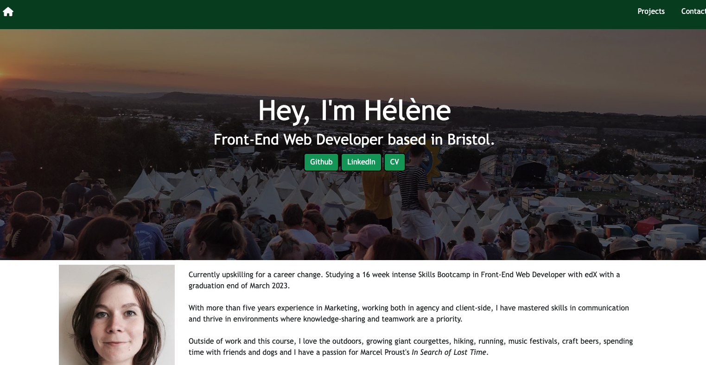

# React Portfolio

## Description

This portfolio displays all the projects I have been working on since the beginning of the Front-End Web Development bootcamp that started in November 2022.
It was created using React.js and Bootstrap.
Working on this portfolio allowed me to get very familiar with React, and research how to use certain toolkits in that specific environment, such as Font Awesome.

## Installation

No installation is needed to view this portfolio in the browser, just open it and browse.

My portfolio looks like the below and the application can be found live [here](https://helenesauve.github.io/react-portfolio/)

## Future Development

I will continue to edit my portfolio with future projects and continue my learning post bootcamp 

